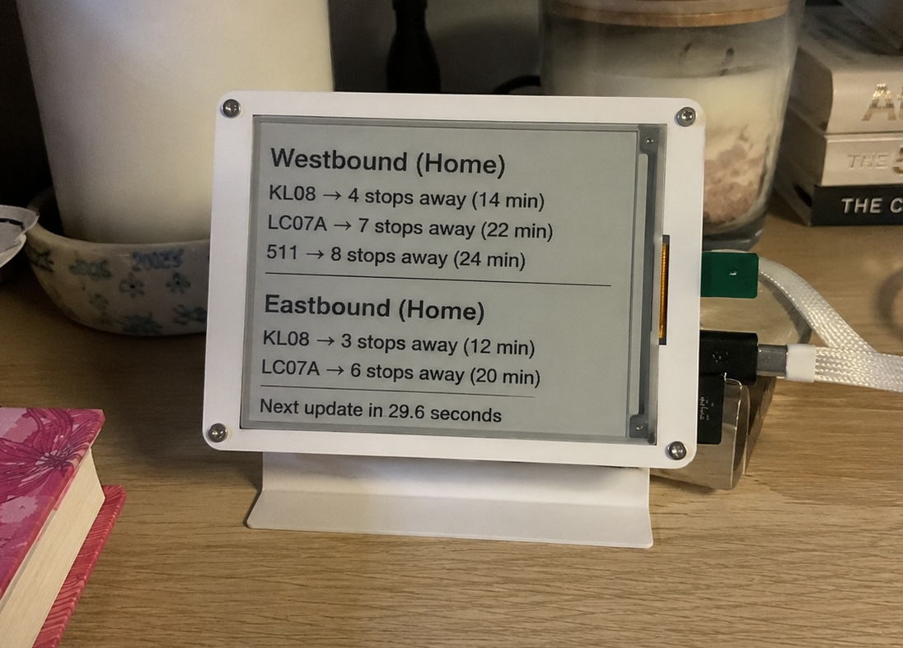

# Antalya Bus ETA Dashboard

A lightweight Python script that fetches real-time bus arrival data for Antalya bus stops using the public Kentkart web endpoint.

Designed for:
- Raspberry Pi Zero 2W
- ESP32 e-ink display projects
- Always-on home transit dashboards

## Features
- Live bus ETAs
- Stops-away indicator
- Multi-stop support
- 30-second adaptive polling
- Minimal dependencies

## Example output
KL08 → 4 stops away (14 min)  
LC07A → 7 stops away (22 min)



## Usage
```bash
pip install -r requirements.txt
python antalyakart_dashboard.py


